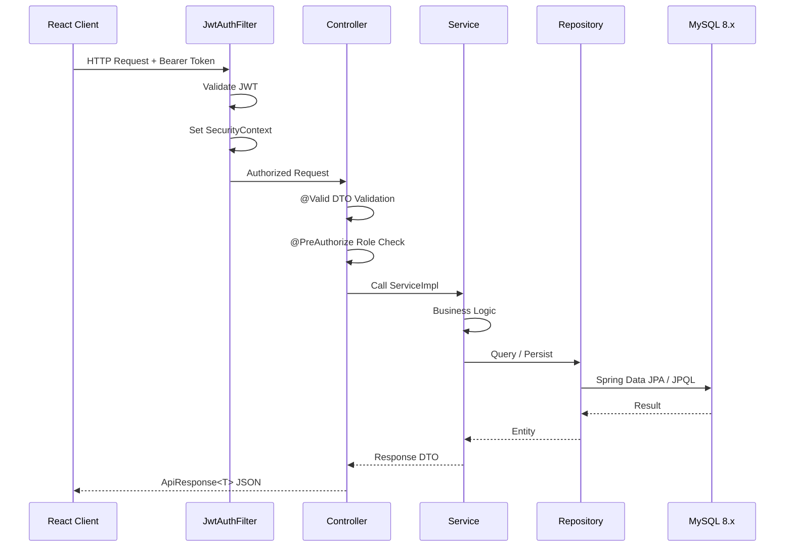
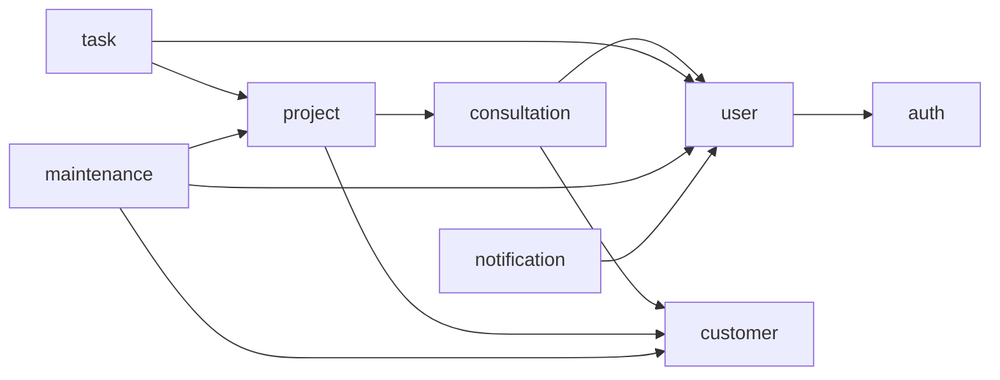

# Backend Architecture — HungPhu CRM

## System Overview

```mermaid
graph TB
    subgraph Client
        React[React + Vite]
    end

    subgraph Spring Boot API
        Filter[JwtAuthFilter<br/>Security Chain]
        Controller[Controllers]
        Service[Services]
        Repo[Repositories<br/>JPA + Custom]
    end

    subgraph Database
        MySQL[(MySQL 8.x)]
    end

    subgraph Jobs
        Cron[Cron Jobs<br/>Maintenance Reminder]
    end

    subgraph Storage
        FileStorage[File Storage<br/>Evidences / Documents / Invoices]
    end

    React -->|HTTP/REST + JWT| Filter
    Filter --> Controller
    Controller --> Service
    Service --> Repo
    Repo -->|Spring Data JPA / Hibernate| MySQL
    Service --> FileStorage
    Cron -->|@Scheduled| Service
```

**Architecture**: Monolith với feature-based packages
- Mỗi feature = 1 package độc lập, tự quản lý entity + service + repository
- Giao tiếp async qua `ApplicationEventPublisher`
- Dễ tách microservice sau này nếu cần

---

## Folder Structure

```
src/main/java/com/hungphu/crm/
│
├── CrmApplication.java                  # Entry point, @EnableScheduling
│
├── shared/
│   ├── config/
│   │   ├── SecurityConfig.java          # Spring Security, filter chain
│   │   ├── JwtConfig.java               # Secret, expiration từ env
│   │   ├── CorsConfig.java              # Cho phép React Vite gọi API
│   │   └── AsyncConfig.java             # ThreadPool cho @Async events
│   ├── security/
│   │   ├── JwtAuthFilter.java           # OncePerRequestFilter
│   │   ├── JwtUtil.java                 # Generate / validate / parse token
│   │   └── UserDetailsServiceImpl.java  # Load user từ DB
│   ├── exception/
│   │   ├── GlobalExceptionHandler.java  # @RestControllerAdvice
│   │   ├── ResourceNotFoundException.java
│   │   └── BusinessException.java
│   ├── response/
│   │   ├── ApiResponse.java             # Wrapper success/error
│   │   └── PageMeta.java                # Pagination metadata
│   ├── enums/                           # Enums dùng chung toàn hệ thống
│   │   ├── UserRole.java                # ADMIN, MANAGER, EMPLOYEE
│   │   ├── TaskStatus.java
│   │   ├── ConsultationStatus.java
│   │   ├── MaintenanceStatus.java
│   │   └── ...
│   └── utils/
│       ├── DateUtils.java
│       └── FileUtils.java
│
└── features/
    ├── auth/                # JWT login, refresh
    ├── user/                # Quản lý tài khoản nhân viên
    ├── customer/            # Quản lý khách hàng
    ├── consultation/        # Theo dõi tư vấn — Kanban
    ├── project/             # Dự án, thanh toán, tài liệu
    ├── task/                # Công việc khảo sát / lắp đặt
    ├── maintenance/         # Hợp đồng & lịch bảo trì
    └── notification/        # Thông báo + cron job reminder

src/main/resources/
├── db/migration/            # Flyway scripts
│   ├── V1__create_users.sql
│   ├── V2__create_customers_consultations.sql
│   ├── V3__create_projects_tasks.sql
│   ├── V4__create_maintenance.sql
│   ├── V5__create_notifications.sql
│   └── V6__add_indexes.sql
├── application.yml
├── application-dev.yml
└── application-prod.yml
```

---

## Feature Anatomy

### Feature đơn giản — `user`

```
features/user/
├── UserController.java
├── UserService.java                 # interface
├── UserServiceImpl.java             # implementation
├── repository/
│   └── UserRepository.java          # extends JpaRepository<User, UUID>
├── entity/
│   └── User.java                    # @Entity, @Table("users")
├── dto/
│   ├── CreateUserRequest.java
│   ├── UpdateUserRequest.java
│   └── UserResponse.java
├── mapper/
│   └── UserMapper.java              # Entity ↔ DTO
└── CONTEXT.md
```

### Feature có business logic phức tạp — `project`

```
features/project/
├── ProjectController.java
├── PaymentInstallmentController.java
├── ProjectDocumentController.java
├── service/
│   ├── ProjectService.java
│   ├── ProjectServiceImpl.java
│   ├── PaymentInstallmentService.java
│   └── PaymentInstallmentServiceImpl.java
├── repository/
│   ├── ProjectRepository.java
│   ├── ProjectRepositoryCustom.java      # interface filter/search
│   ├── ProjectRepositoryCustomImpl.java  # CriteriaBuilder queries
│   ├── PaymentInstallmentRepository.java
│   └── ProjectDocumentRepository.java
├── entity/
│   ├── Project.java
│   ├── PaymentInstallment.java
│   └── ProjectDocument.java
├── dto/
│   ├── CreateProjectRequest.java
│   ├── ProjectResponse.java
│   ├── ProjectDetailResponse.java
│   ├── AddPaymentRequest.java
│   └── PaymentInstallmentResponse.java
├── mapper/
│   ├── ProjectMapper.java
│   └── PaymentInstallmentMapper.java
├── event/
│   └── ProjectCreatedEvent.java          # ApplicationEvent
└── CONTEXT.md
```

### Feature có Cron Job — `maintenance`

```
features/maintenance/
├── MaintenanceContractController.java
├── MaintenanceScheduleController.java
├── service/
│   ├── MaintenanceContractService.java
│   ├── MaintenanceContractServiceImpl.java
│   ├── MaintenanceScheduleService.java
│   └── MaintenanceScheduleServiceImpl.java
├── job/
│   └── MaintenanceReminderJob.java       # @Scheduled cron
├── repository/
│   ├── MaintenanceContractRepository.java
│   ├── MaintenanceScheduleRepository.java
│   └── MaintenanceEvidenceRepository.java
├── entity/
│   ├── MaintenanceContract.java
│   ├── MaintenanceSchedule.java
│   └── MaintenanceEvidence.java
├── dto/
│   ├── CreateContractRequest.java
│   ├── ContractResponse.java
│   ├── ScheduleResponse.java
│   └── CompleteScheduleRequest.java
├── mapper/
│   ├── ContractMapper.java
│   └── ScheduleMapper.java
└── CONTEXT.md
```

---

## Request Flow



### Trách nhiệm từng layer

| Layer | Trách nhiệm | KHÔNG làm |
|-------|-------------|-----------|
| `JwtAuthFilter` | Validate token, set SecurityContext | Business logic |
| `Controller` | Route, validate DTO, phân quyền `@PreAuthorize` | Query DB, logic nghiệp vụ |
| `Service` | Business logic, transaction, gọi event | Truy vấn JPQL/Criteria trực tiếp |
| `Repository` | Truy vấn dữ liệu, JPQL, Criteria API | Business logic |
| `Mapper` | Chuyển đổi Entity ↔ DTO | Logic, tính toán |

---

## Feature Dependencies



### Quy tắc giao tiếp giữa feature

```java
// ✅ DO: Inject Service của feature khác qua Spring DI
@Service
@RequiredArgsConstructor
public class ProjectServiceImpl implements ProjectService {
    private final CustomerService customerService; // OK
}

// ✅ DO: ApplicationEventPublisher cho async / loose coupling
// Khi tư vấn thành công → tạo project → gửi notification
@Service
@RequiredArgsConstructor
public class ConsultationServiceImpl implements ConsultationService {
    private final ApplicationEventPublisher eventPublisher;

    @Transactional
    public void markSuccess(UUID id) {
        // ... cập nhật trạng thái
        eventPublisher.publishEvent(new ConsultationSuccessEvent(consultation));
    }
}

@Component
@RequiredArgsConstructor
public class ConsultationEventListener {

    private final NotificationService notificationService;

    @EventListener
    @Async
    public void onSuccess(ConsultationSuccessEvent event) {
        notificationService.createForAdmins(
            NotificationType.CONSULTATION_SUCCESS, event.getConsultationId());
    }
}

// ❌ DON'T: Gọi Repository của feature khác
// taskRepository.findByProject(...)  ← từ trong MaintenanceService: SAI
```

---

## Checkout Flow đặc thù HungPhu CRM — Tư vấn → Dự án

```
POST /api/v1/consultations/{id}/convert
    → JwtAuthFilter validate token
    → ConsultationController nhận ConvertToProjectRequest
    → @PreAuthorize("hasRole('ADMIN')")
    → ConsultationServiceImpl.convertToProject():
        1. Load Consultation, kiểm tra status == THANH_CONG
        2. Resolve Customer (tạo mới hoặc gắn customer_id cũ)
        3. Tạo Project (snapshot elevator_type, project_type)
        4. Gán supervisor
        5. @Transactional — commit cả 2 hoặc rollback
        6. publishEvent(ProjectCreatedEvent) → notification async
    → Trả về ProjectResponse
```

---

## Cron Job Flow — Nhắc lịch bảo trì

```
@Scheduled(cron = "0 0 8 * * *", zone = "Asia/Ho_Chi_Minh")
MaintenanceReminderJob.sendReminders()
    → Query MaintenanceSchedule WHERE status = CHO_THUC_HIEN
        AND scheduled_date <= NOW() + 7 ngày
    → Với mỗi schedule:
        NotificationService.createMaintenanceReminder(schedule)
            → INSERT notifications (scheduled_at, sent_at = null)
    → Email/Push gửi qua NotificationDispatcher (sent_at = NOW())
```

---

## Shared vs Feature

| Shared (dùng chung) | Feature (riêng từng module) |
|---------------------|----------------------------|
| `JwtAuthFilter`, `JwtUtil` | Entity, Repository, Service, Controller |
| `GlobalExceptionHandler` | DTO Request / Response |
| `ApiResponse<T>`, `PageMeta` | Mapper (Entity ↔ DTO) |
| `ResourceNotFoundException`, `BusinessException` | Event, EventListener |
| Enums toàn hệ thống | Cron Job (`@Scheduled`) |
| `FileStorageService` | CONTEXT.md |
| `DateUtils`, `FileUtils` | |

---

## Configuration

### Environment Variables

```bash
# Database
DB_HOST=db
DB_PORT=3306
DB_NAME=hungphu_crm
DB_USER=hungphu
DB_PASSWORD=secret

# JWT
JWT_SECRET=your-256-bit-secret
JWT_EXPIRATION=86400000       # 1 ngày (ms)
JWT_REFRESH_EXPIRATION=604800000  # 7 ngày (ms)

# App
SERVER_PORT=8080
SPRING_PROFILES_ACTIVE=prod

# File Storage
STORAGE_PATH=/app/uploads     # local hoặc mount volume
```

### application.yml

```yaml
spring:
  datasource:
    url: jdbc:mysql://${DB_HOST}:${DB_PORT}/${DB_NAME}?useSSL=false&allowPublicKeyRetrieval=true&serverTimezone=Asia/Ho_Chi_Minh
    username: ${DB_USER}
    password: ${DB_PASSWORD}
    driver-class-name: com.mysql.cj.jdbc.Driver

  jpa:
    hibernate:
      ddl-auto: validate        # Schema do Flyway quản lý — KHÔNG để create/update
    show-sql: false
    properties:
      hibernate:
        dialect: org.hibernate.dialect.MySQL8Dialect
        format_sql: true

  flyway:
    enabled: true
    locations: classpath:db/migration
    baseline-on-migrate: true

  servlet:
    multipart:
      max-file-size: 10MB
      max-request-size: 30MB

  task:
    scheduling:
      pool:
        size: 5               # Thread pool cho @Scheduled

jwt:
  secret: ${JWT_SECRET}
  expiration: ${JWT_EXPIRATION:86400000}
  refresh-expiration: ${JWT_REFRESH_EXPIRATION:604800000}

server:
  port: ${SERVER_PORT:8080}
```

### Secrets Handling

- ❌ Không commit `.env` hay giá trị thật vào git
- ✅ Dùng `.env.example` làm template
- ✅ Production: biến môi trường qua Docker Compose hoặc secret manager

---

## Global Setup — CrmApplication.java

```java
@SpringBootApplication
@EnableScheduling          // Bật cron job cho MaintenanceReminderJob
@EnableAsync               // Bật @Async cho EventListener
public class CrmApplication {
    public static void main(String[] args) {
        SpringApplication.run(CrmApplication.class, args);
    }
}
```

```java
// SecurityConfig.java — filter chain
@Configuration
@EnableWebSecurity
@EnableMethodSecurity      // Bật @PreAuthorize trên Controller
@RequiredArgsConstructor
public class SecurityConfig {

    private final JwtAuthFilter jwtAuthFilter;

    @Bean
    public SecurityFilterChain filterChain(HttpSecurity http) throws Exception {
        return http
            .csrf(AbstractHttpConfigurer::disable)
            .sessionManagement(s -> s.sessionCreationPolicy(STATELESS))
            .authorizeHttpRequests(auth -> auth
                .requestMatchers("/api/v1/auth/**").permitAll()
                .anyRequest().authenticated()
            )
            .addFilterBefore(jwtAuthFilter, UsernamePasswordAuthenticationFilter.class)
            .build();
    }
}
```

---

## API URL Structure

```
/api/v1/auth/login                              POST  — public
/api/v1/auth/refresh                            POST  — public

/api/v1/users                                   GET, POST         — ADMIN
/api/v1/users/{id}                              PATCH, DELETE     — ADMIN

/api/v1/customers                               GET, POST         — ALL
/api/v1/customers/{id}                          GET, PATCH        — ALL

/api/v1/consultations                           GET, POST         — ALL
/api/v1/consultations/{id}/status               PATCH             — ALL
/api/v1/consultations/{id}/convert              POST              — ADMIN

/api/v1/projects                                GET               — ALL
/api/v1/projects/{id}                           GET               — ALL
/api/v1/projects/{id}/tasks                     GET, POST         — ADMIN, MANAGER
/api/v1/projects/{id}/payments                  GET, POST         — ADMIN, MANAGER
/api/v1/projects/{id}/documents                 GET, POST         — ALL

/api/v1/tasks/{id}                              GET, PATCH        — ALL
/api/v1/tasks/{id}/status                       PATCH             — ALL
/api/v1/tasks/{id}/evidences                    POST              — EMPLOYEE

/api/v1/maintenance/contracts                   GET, POST         — ALL
/api/v1/maintenance/contracts/{id}              GET               — ALL
/api/v1/maintenance/contracts/{id}/schedules    GET               — ALL
/api/v1/maintenance/schedules/{id}/complete     PATCH             — ALL

/api/v1/notifications                           GET               — ALL
/api/v1/notifications/{id}/read                 PATCH             — ALL
```

---

## Docker

```dockerfile
# Dockerfile — multi-stage build với Gradle
FROM eclipse-temurin:21-jdk-alpine AS builder
WORKDIR /app
COPY gradlew build.gradle settings.gradle ./
COPY gradle ./gradle
RUN ./gradlew dependencies --no-daemon
COPY src ./src
RUN ./gradlew bootJar --no-daemon -x test

FROM eclipse-temurin:21-jre-alpine
WORKDIR /app
COPY --from=builder /app/build/libs/*.jar app.jar
EXPOSE 8080
ENTRYPOINT ["java", "-jar", "app.jar"]
```

```yaml
# docker-compose.yml
services:
  app:
    build: .
    ports:
      - "8080:8080"
    environment:
      DB_HOST: db
      DB_PORT: 3306
      DB_NAME: hungphu_crm
      DB_USER: ${DB_USER}
      DB_PASSWORD: ${DB_PASSWORD}
      JWT_SECRET: ${JWT_SECRET}
      SPRING_PROFILES_ACTIVE: prod
    volumes:
      - uploads_data:/app/uploads     # File storage mount
    depends_on:
      db:
        condition: service_healthy
    restart: unless-stopped

  db:
    image: mysql:8.0
    environment:
      MYSQL_DATABASE: hungphu_crm
      MYSQL_USER: ${DB_USER}
      MYSQL_PASSWORD: ${DB_PASSWORD}
      MYSQL_ROOT_PASSWORD: ${DB_ROOT_PASSWORD}
    ports:
      - "3306:3306"
    volumes:
      - mysql_data:/var/lib/mysql
    healthcheck:
      test: ["CMD", "mysqladmin", "ping", "-h", "localhost"]
      interval: 10s
      timeout: 5s
      retries: 5
    restart: unless-stopped

volumes:
  mysql_data:
  uploads_data:
```
